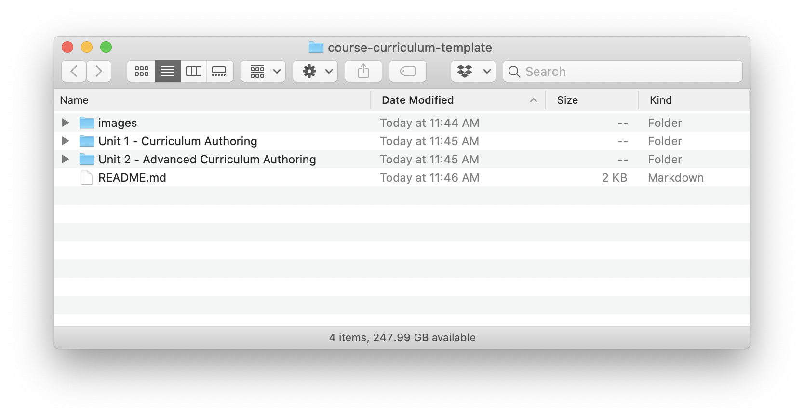

# Curriculum Authoring

## Overview

When developing curriculum at Lambda School, we use a standard format based on Markdown along with a simple folder structure for organization. This repository serves as a template for new curriculum repositories, as well as including material explaining how our curriculum is authored and structured. In a sense, it is both documentation and an example for a curriculum set rolled into one.

## Instructions

At the top level of the repository for a curriculum set should be a file called `README.md` just like this one. The first line of the file should be an h1 heading (single `#`) with the title of the curriculum set. An h2 heading (two `#`s) called Overview begins the section that will appear on Training Kit to introduce the course.

The entire contents of this file *will* appear on GitHub, but only the Main title and Overview section will be seen by students.

Therefore, any other h2 sections (like this one!) will be ignored by the curriculum generator, and can be used to provide additional notes for instructors, curriculum developers, etc.

## Structure

### Unit Folders

In addition to a README file like this one, the top level folder in the curriculum set repo should include folders for each Unit (ie. 4 sprints) of curriculum. These folders should be named like so:

The format here is important. Each folder should begin with `Unit X` where X is the unit number, followed by a space, then a hyphen, then a space, followed by the unit's name.

### Images

Place any images used in the repo in a top-level folder called images.
